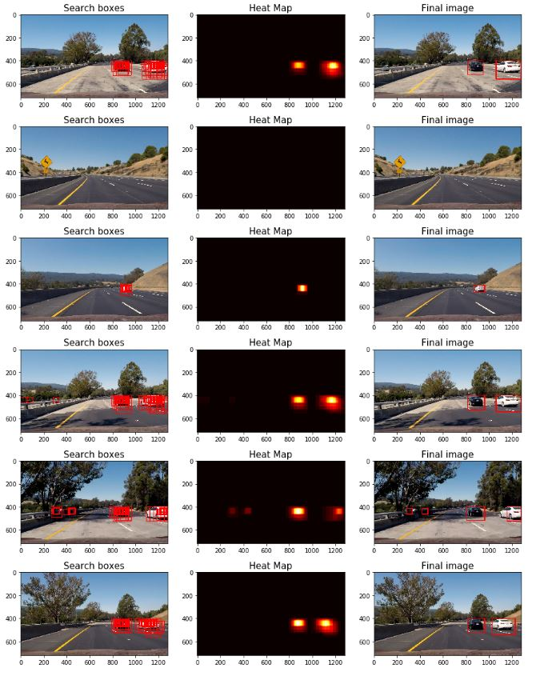

# CarND Vehicle Detection Project

## Goals

The goals/steps of this project are the following:

- Perform a Histogram of Oriented Gradients (HOG) feature extraction on a labeled training set of images and train a classifier Linear SVM classifier
Optionally, you can also apply a color transform and append binned color features, as well as histograms of color, to your HOG feature vector.
Note: for those first two steps don't forget to normalize your features and randomize a selection for training and testing.
- Implement a sliding-window technique and use your trained classifier to search for vehicles in images.
- Run your pipeline on a video stream (start with the test_video.mp4 and later implement on full project_video.mp4) and create a heat map of recurring detections frame by frame to reject outliers and follow detected vehicles.
- Estimate a bounding box for vehicles detected.

## [Rubric](https://review.udacity.com/#!/rubrics/513/view) points

Here I will consider the rubric points individually and describe how I addressed each point in my implementation.

### Writeup / README

#### 1. Provide a Writeup / README that includes all the rubric points and how you addressed each one. You can submit your writeup as markdown or pdf. [Here](https://github.com/udacity/CarND-Vehicle-Detection/blob/master/writeup_template.md) is a template writeup for this project you can use as a guide and a starting point.

You're reading it!
All of the code for the project is contained in the [CarND Vehicle Detection notebook](Vehicle_detection_BK.ipynb).

### Histogram of Oriented Gradients (HOG)

#### 1. Explain how (and identify where in your code) you extracted HOG features from the training images.

My first step is to load all of the vehicle and non-vehicle image paths from the provided dataset. A random sample of images from both car and non-car dataset are shown below, respectively:


The total nummber of the training images is:

- Vehicle train images count: 8792
- Non-vehicle train image count: 8968

The feature extraction code (spatial, color and HOG) is contained In cell `[4]` of [CarND Vehicle Detection notebook](Vehicle_detection_BK.ipynb). By using the method of ` get_hog_features `, a comparsion of a car image and its associated histogram of oriented gradients, as well as the same for a non-car image are shown as below:


In the cell of `[6]` of [CarND Vehicle Detection notebook](Vehicle_detection_BK.ipynb), a function of extract_features  is to accept a list of image paths, spatial information, Histogram and HOG parameters ( as well as one of a variety of destination color spaces, to which the input image is converted) and produces a flattened array of spatial feature, histogram feature, or/and HOG features as defined for each image in the list.

#### 2. Explain how you settled on your final choice of HOG parameters.

The parameters were found by manually changing them and experimenting. My final choice of HOG parameters based upon the performance of the SVM classified produced using them. Not only the accuracy with which the classiefier made prediction on the test data, but also the speed at which the classifier is able to make predictions have been considered. The final parameters are the following:

|Parameter|Value|
|:--------|----:|
|Color Space|YCrCb|
|HOG Orient|11|
|HOG Pixels per cell|8|
|HOG Cell per block|2|
|HOG Channels|All|
|Spatial bin size| (16,16)|
|Histogram bins|32|
|Histogram range|(0,256)|
|Classifier|LinearSVC|
|Scaler|StandardScaler|

With this parameters, it took 130.83 seconds to get features and 17.63 seconds to train SVC.

#### 3.  Describe how (and identify where in your code) you trained a classifier using your selected HOG features (and color features if you used them).

In the section titled "Train a Classifier" ( cell of `[8]` of [CarND Vehicle Detection notebook](Vehicle_detection_BK.ipynb) ). I trained a linear SVM with the default classifier parameters and using spatial intensity, chanell intensity histogram features , and HOG features and was able to achieve a test accuracy of 99.41%.

### Sliding Window Search

#### 1. Describe how (and identify where in your code) you implemented a sliding window search. How did you decide what scales to search and how much to overlap windows?

In the section titled ` Using Classifier to detect cars in the images ` (cell of `[9]` of [CarND Vehicle Detection notebook](Vehicle_detection_BK.ipynb ),  the method find_cars from the lesson materials has been adapted. The method combines spatial features, histogram features and HOG feature extraction with a sliding window search, but rather than perform HOG feature extraction on each window individually which can be time consuming, the HOG features are extracted for the entire image (or a selected portion of it) and then these full-image features are subsampled according to the size of the window and then fed to the classifier. The method performs the classifier prediction on the all three features (spatial, histogram, and HOG) for each window region and returns a list of rectangle objects corresponding to the windows that generated a positive ("car") prediction.

Several configuration of windows sizes and positions with various overlaps in the X and Y directions have been explored. My observations are as follows:
 - Too many false postives with small (0.5) scales;
 -  75% overlap produced more redundant true positive detections than 50% overlap
 - An appropriate vertical range of image should be considered for each windows size (e.g. smaller range for smaller scales) to reduce the chance for false positives in areas where cars at that scale are unlikely to appear
- A true positive is typically accompanied by several positive detections, while false positives are typically accomnpnaied by one or two detections. So a combined heatmap and threshold is good enough to differentiate the two. 
 
 The code for the implementation of bapplying Heatmap and threshold can be found from cell ` [9] ` to cell ` [11] ` of [CarND Vehicle Detection notebook](Vehicle_detection_BK.ipynb) )

#### 2. Show some examples of test images to demonstrate how your pipeline is working. What did you do to optimize the performance of your classifier?

After implementing each individual functions, a whole pipline has been built and the code is contained in the cell ` [14]` of [CarND Vehicle Detection notebook](Vehicle_detection_BK.ipynb) ). The following image shows the results applied to the test images with implementation of heatmap and threshold:



It is a really time consuming to calculate HOG on each particular window. a HOG sub-sampling was implemented as suggested on Udacity's lectures. To further optimize the performance, changes to swind sizing and overlap as described above and lowering the heatmap threshols to improve the accracy of detection have been applied, 

### Video implementation

#### 1. Provide a link to your final video output. Your pipeline should perform reasonably well on the entire project video (somewhat wobbly or unstable bounding boxes are ok as long as you are identifying the vehicles most of the time with minimal false positives.)

The video output could be found [project_video.mp4](video_output/project_video.mp4)

#### 2. Describe how (and identify where in your code) you implemented some filter for false positives and some method for combining overlapping bounding boxes.

Altough Some effort has been put to minimize false positives by using a heatmap and threshold in the pipeline, this is not good enough. The code for processing frames of video is contained in the cell `[14]` of [CarND Vehicle Detection notebook](Vehicle_detection_BK.ipynb) and is identical to the code for processing a single image decribed above, with the exception of storing the detections from prvious 10 frames of video. Rather than performing the heatmap/threshold/label steps for the current frame's detections, the detections for the past 10 frames are combined and added to the heatmap with a certain weights:

```

car.ave_heatmap = car.ave_heatmap*0.3 + heatmap_final*0.7/len(car.heatmap)

```

### Discussion

#### 1. Briefly discuss any problems / issues you faced in your implementation of this project. Where will your pipeline likely fail? What could you do to make it more robust?


I have problem to improve the detection accuracy while implementing this project.To an certain degree, the accuracy of classifier has to be balanced with execution speed. As described above, integrating detection from previous frames could mitigate some misclassifications, but it has some potential to raise another issue: vehicles that significantly changes enviroments may tend to escape being label.

My pipline may fail in the following scenarios:

- vehicles (such as HOG features) do not resemble those in the dataset;
- some extreme lighting or enviromental conditions;
- oncoming  cars as well as distant cars 

I would like to implement the following to make the pipeline more robust:

- use the vehicle location, speed, driving direction to prediect its location in the subsequent frames;
- Using dynamic searching ranges to speed up execution;
- The windows size could change for different X and Y values to minimize the number of windows to process;
- Applying a convolution neural network together with the proposed traditional technical of computer version;

